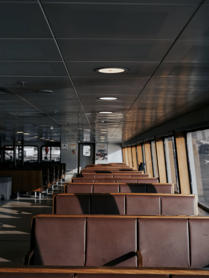

Pendant ce temps, de l'autre côté de l'Atlantique, aux USA, habitent Mme et Mr Classical Pop. C'est le moment critique du music-at-first-sight : la Violoniste, en voyage d'étude, croise mme et mr dans le même couloir d'un grand bâtiment américain de logements. Ils se croisent sans se rencontrer vraiment.

le ton est surpris ou amusé voire ironique comme si personne ne laisse rien voir delle ou de lui, avec un rire.

mais dans le fond, L'interaction est , presque explosive, presque comme si ils allaient lancer des bombes à eau lancées de manière espiègle, pour que ce soit pas violent, en regardant avec du recul, meme si ce nest pas sur, mais laissant une empreinte musicale indélébile dans l'esprit de chacun.

a la premiere impression, personne na eu peur.

dans les couloirs de lecole de musique, m. classical pop croise le genie voyageur de la lampe , celui qui a propose les voeux (voeux de passer a la tele) et sa rencontre qui devait durer seulement le temps de dire bonjour, dure plusieurs semaines. Il y a des rumeurs sur les fréquentations de M. Classical Pop, mais les rumeurs s'arrêtent là.
 sans bien se connaitre ils vont prendre le bateau ensemble.

voyage en bateau

Tres tot, la Violoniste,mme et m classical pop prennent le bateau Ferry Boat ensemble (one-million-routes) pour faire connaissance. repere : le bateau peut etre place a la toute fin, quand les destins se sont croises et inverses, au debut mr classical pop avait le trait de caractere qui comprend le plus de choses ou qui decouvre en voyant/entendant la musiqu, vers la fin a plus ces traits, au debut mme classical pop est celle qui en fait qu'a sa tete, mme musicienne regarder plus autour delle, et elles echangent un peu de traits de caractere.

Le bateau est très grand, l'ambiance dans le bateau va a priori. La premiere cousine invité est une cousine de mme classical pop (mme classical pop rebel qui n'est pas mme classical pop, mais elle joue le premier role de mme classical pop, jouer de la musique classique ou pop ou de voyager en bateau (elle apparait dans le premier voyage en bateau avec mme musicienne / mr classical pop), elle disparait après). Mme musicienne décide de croiser la fameuse cousine au même étage, de cohabiter/d'être en colocation dans les tous débuts de l'histoire. Ca bouleverse ses vues dans la musique classique ou pop.

    on demande à mme classical pop de croiser beaucoup d'amies , d'inviter beaucoup d'amies, même si elle en fait pas de meilleures amies.

    la musicienne pendant un jeu essaie de trouver dautres personnes (elle passe du temps avec mme classical (une autre amie, quelquun qui nest pas dans lhistoire) a lappartement pour jouer de la musoque classique et au centre commercial).

    La premiere conversation importante arrive sur qui va poster quoi (qui fera le plus peur , aura le plus de popularite sur les reseaux, mme musicienne doit resster plus discrete commme elle est invitee), Madame/Mr classical pop pourra poster son visage, sa voix, ses commentaires, mais mme musicienne ne publiera pas sa photo. La premiere conversation importante est sur ce qui est "vrai" sur eux (mme classical pop a un caractere comme si elle a ce qu'elle veit avec n'importe quel moyen), le caractere qu'on a, quand on veut/veut pas/aime/aime pas quelque chose. Leur goût, comment il faut parler. les limites est suils ne savent pas sils vont reussir.

