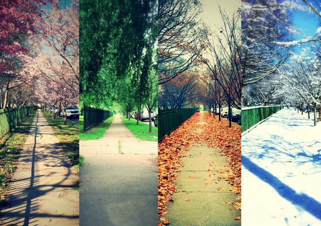
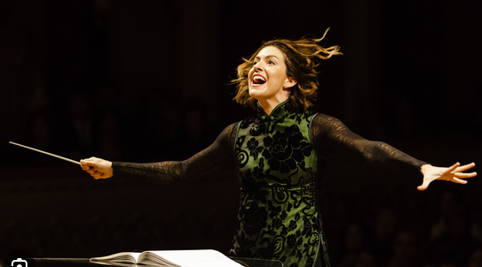
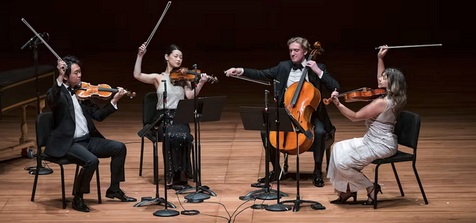

    repere : au 1er episode ou 2e quand mme musicienne en est a apprendre la musique elle rencontre un developpeur rails qui traverse les villes comme les saisons de vivaldi et transporte aveclui l'hologramme d'une pop star, mais elle croise son chemin seulement. (holographic-companion)

la il y a comme un break. cest une periode ou les news dans les journaux sont tres agitees (ville-news--music-agitee) jusque pendant leur retour en france (1 semaine) 

repere : dans la periode ce ce break on demande a mme et mrclassical pop et mme musicienne s'ils aimeraient faire une aventure dans le pays de la musique ( pas un oays ocncret (italie, france,allemagne,autriche) mais un oays entre les partitions, la scene, backstage et onstage)

repere : peut etre au 1er episode ou 4e episode piur calmer des tensions, quand mme musicienne doit apprendre la musique
- mme musicienne essaie de s'intégrer au monde de la tv des videos "& friends" de la musique classique mais elle trouve qu'il y a trop de pression et elle abandonne à d'autres occupations

aux usa, mme classical pop doit, quand tu as plus de 18 ans, bookmark ce quetu aime/aimes pas qui vient du monde entier avec dautres amies. mme et mr classical pop voudraient passer a la tele. ils retournent a la television ou ils font passer mme musicienne en priorite avec eux. aux usa, ils participent a unz ewperience de chat IA ou ils veulent determiner la suite de leurs voyages, si ce sera plus ou moins cool. (ai-chatbot-experience) a letranger, il passent a la tele dans une ville de disco ou est traduit en direct dans un plateau pour en dire plus. repere : peut etre au 1er episode, quand ils apprennent a se connaitre pour devoilee leur foyers d'origines pu au 4e episode pour permettre une fin differente , reperes ; ils se sont rencontrer mais se connaissent a peine

un developpeur rails montre a mr classical pop comment il peut chosse his electronic info : sport, activity, outdoors, indoors activity programming, digital ids, video photo, strong password, weak, musique photos, AI, social media digital ids posted by any 1. repere : vers le début, mr classical pop vient darriver a lecole de musique, un developpeur a la sortie de lecole de musique, lui parle des reseau sociaux, twitter, facebook pour qu'il commence à publier sa musique et lui donne les cles pour devenir influenceur.

un autre developpeur propose d'emmener mme classical pop ou musicienne sur le boulevard de l'amour (from-bash-to-boulevard). repere : au1e episode pour calmer des tensions quand mme musicienne apprend la musique mais la rencontre nest pas ideale pour le moment

mme et m classical pop commencent a avoir pour motto "a rhapsody for you and me, do you want to be part ofmy symphony?" pour inviter dautres gens. ils doivent chacun jouer leur role sur les reseaux sociaux (miniature-musicien) et commencent a gagner de la popylarite sur des reseaux sociaux amerixains minuature (minuature-usa-social-media) repere : comme une invitation pu une simple motto au 2e episode qui ne determine rien pour la suite

