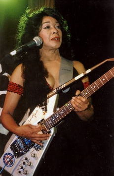

c'est alors qu'intervient l'anomalie (bookish-cruel-love). Devant un stand de brocante en France, une vidéo générée par une IA ouvre une faille vers un monde parallèle : un parc d'attractions américain déformé. 

Ce portail les connecte à la République de l'Amour Cruel, un univers calqué sur la pop culture des USA où le couple "Monsieur et Madame Parfait" (Mr et Mme Classical Pop) utilise la musique classique comme une arme brute pour remodeler les consciences de leur audience. repere : 3e episode madame Classical Pop veut jouer le rôle de la "dame au milieu" (thé woman-in-the-middle) et apparaître sur tous les grands affichages , pour qu'on ne voit qu'elle et pour semer la terreur dans son quartier.
Elle veut jouer la "dame au milieu de tout" (the woman in the middle of everything) pour être au courant de toutes les nouvelles, toutes les rumeurs, en temps réel, etout le temps. Elle coupe beaucoup de canaux de messages de son quartier, et autorise beaucoup de messages pour que ça lui arrive. On peut lui écrire avec des signatures, d emusique ou de partitions (comme des nuances uo appogiatures).

mme et mr classical pop recommencent a sinscrire a lecole de musique locale et diffuser des rumeurs comme quoi apprendre a se connaitre est long parfois. cest leur nouvelle tentative de se rendre bien sur scene (performing-arts, perform-me) repere : comme au 2e episode, sauf quau 3e episode, le visage de mme classical pop s'affichhe oartout dans les rues (out-of-home-face)

Ensuite commence le voyage en train/bus pour quoi ils ont "signé". Ils documentent tout. Via un blog urbain (city-blogger), ils écrivent sur leurs instruments et leurs moyens de transport. Ils basculent dans une aventure permanente (out-of-the-morning-adventure), guidés par la météo et une IA locale. Ils convertissent leurs maquettes via yt-mp3 et lancent la tournee-coeur-ouvert pour secouer le public jusqu'à ce qu'il aime le classique. chaque fois ou il ont decide detre en mode aventures, ils utilisent from-dusk-till-dawn-dev-session, a full-stack code generator that transforms a simple HTML form into a bash script that scaffolds your entire project from backend APIs to frontend templates.

Leur quotidien devient une lutte sur la route (road-struggle-story). Les "Classical Pop Buddies" et la Violoniste voyagent dans un van délabré, partageant l'épuisement des fins de mois difficiles, adoptant un état d'esprit de hacker-musicien (musician-mindset) face aux contrôles douaniers stricts (musical-border-control). repere : 2e episode , ils peuvent itiliserl'IA mais ce nest pas pour arranger leur celebrite

