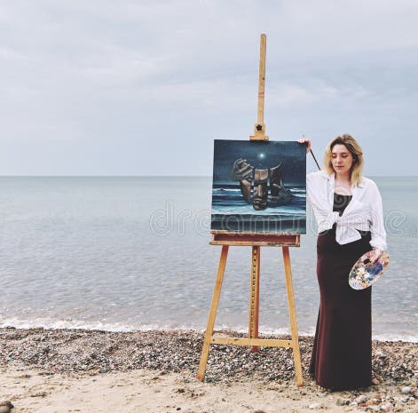
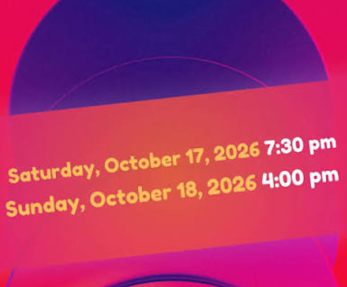

tres tot, mme classical pop se revele etre half-a-medium. 

La nuit en programmant des bases de données qui contiennent des informations sur des personnes, dans un terminal, en fermant les yeux. 

ELle a des visions reelles sur les gens , elle voit la tête/photo d'une personne sur une face d'une carte elle retourne une carte et il y a écrit une texte ou une information comme un secret sur quelqu'un. repere : on a demande aux classical de participer au debeloppement web au deuxieme avion (voyage) et elle veut etre plus indepedente avex le developpement web et rails, pour sortir de son foyer, sexprimer elle meme (the-indie-rails) repere : tout lle monde vient de quitter son foyer Dans sa routine quotidienne (dusk-till-dawn), un assistant domotique allume une lampe dès le matin pour signaler qu'il est temps de partir à l'aventure. Une douce mélodie résonne : "I want to be indie, I want to be cool". cest une routine reele pour faire sortir les gens de chez eyx. repere : cest le debut de lhistoire

mme musicienne parle a un developpeur qui lui cobseille d'ecrire une celestial-story qui a des photo, video, text, code avec mme et mr classical pop with AI. repere : au premier mois de leur arrivee , mme musicienne aecrit une histoire

    la fille et le garçon se cachent dans une ligne de commande. la fille voit ce quelle veut voir/et refuse de voir ce qu'elle ne veut pas voir, le garcon voit ie resultat , ensemble ils forment la programmation du futur. qui voit la grande image ?

    sur la route du crepuscule a laube, la question est devse demander : who will guide the other one through the dark side of the morning ? qui va trainer lautre derriere comme un sac au bout dun baton quand on est voyageur (meme si crst gentil)? repere : mme et mr classical pop viennent darriver au premier ou 2e avion et se font pas encore connaitre du crepuscule a l'aube , mme et mr classical pop sont livres a eux meme comme sils doivent vivre une aventure et la nuit ils doivent prevenir tous les dangers/ accidents (legendary-telegram) en hackant le systeme. leur identite double sont musiciens qui ont un entrainement, ou influenceurs sur les reseaux ou ils repandent des rumeurs. repere : cest le "debut de la journee" comme si cest le debut de sa vie, mme musixienne a beaucoup de messages repere : mme musicienne veut y voir "clair et net" dans la programmation/le developpement web, avecun model, vue,controllers. Sur la route, Mme Classical Pop transporte ses compagnons de voyage comme un "bindle" (Un baluchon est un petit sac ou une sacoche servant à transporter des effets personnels. Dans la culture américaine, le baluchon est souvent représenté comme un paquet de tissu attaché au bout d'un bâton et porté sur l'épaule par les vagabonds.)

mr classical pop publie les event like concert, mme classical pop publie les news like traveling news, ils prendre le train , seulment pouvoir lire des news d'un concert, participer un concert, avoir un practice time, performance time, lire other news (event-news-blog).

Pour garder la forme et affronter le monde, mme classical pop ou mme musicienne se bat contre le jeu (bats-contre-le-jeu) et s'inspire de citations de sportifs célèbres (that-basketball-kid). mr classical pop veut rester connected a travers les reseaux sociaux (rails-browser-browse). mr classical pop publie dans potential invention verse ( des publications sur un meme theme dans un lieu de publication parallele)
mme musicienne bookmark ce que elle aimes, epingle le dans la page d'accueil, recois/envoie sms/appel telephonique/email de tes bookmarks (moments partagés en photo, art local, repas partagés). repere : mme musixienneient de rencontrer mme et mr classical et trie les moments partages en photo, art local, repas partages

Se lançant dans une véritable expédition urbaine (city-expedition), mme et m classical se comporte comme un oiseau du matin, et une chouetre de nuit, hackant symboliquement sa ville d'origine grâce aux transports en commun de l'aube au crépuscule. repere : personne ne s'esr rencontre repere : mme et mrclassical pop sont concertiste deja avant de faire toute rencontre

Pour se protéger en ligne, mme musicienne crée un web-crawler à son image, programmé selon ses goûts musicaux. repere : mme musixienne a rencontre mme et me classical pop et vveut apprendre a hacker pour plus de securite en ligne, parfois en competition avec mmr et mr classical pop
mme et me classical pop font un programme a deux : mme classical pop gere la base de donnees comme si elle filtrait les requetes sql comme si elle etait la controleuse du train et mr classical pop gere ce quon voit sur la page html comme si in regardait par la fenetre du train.(hacker-cafe) repere : mme musicienne rencontre mr et mme classical pop sans avoir peur deux

    au debut de lexperience, comme portail pour participer a lexperience , uneapplication demande qui je suis ? (identitz numerique) elle fait choisir entre voyageur, avoir un emploi, musixien(ne) ou sportive et remplir des informations pour avoir un pass dans chaque profil et participer a lexperience (go-for-adventure) repere : mme et mr classical viennent darriver mais mme musicienne cree une application pour rendre des aventures possibles, voire une aventure possible sur les reseaux sociaux

mme et me classical pop font la fete car leur adresse ip est selectionnee (http-party) repere : mme et mr classical font la fete sans se xonnaitre mme classical pop prepare un voyage long courrier robuste (sturdy-long-haul). mme musicienne utilise un projet Un projet interactif pour choisir ta propre stack technologique et vivre une session “dusk till dawn” dans un environnement urbain ou naturel (promenade-stack-selector) et une autre application regional application , application pour une région seulement, qui a un lieu (the-stacks-speaks). repere : mme musicienne apprend a connaitre mme etmr classical pop durant de longues nuit de programmation ou developpement web dans le 2e episode ou a leur 2e grande arrivee en france
mme musicienne publie dans AI tembe : (time-travel-stack-explorer) : AI Tembe est une application d'assistant vocal intelligent et d'automatisation ultra-personnalisée, fortement ancrée sur l'identité locale et régionale de l'utilisateur. repere : mme et mr clqssical pop sont dans la region mais pourrait vouloir briller dans une region etrangere. elle cree une application pour les aider a sadapter au marche local dans nimporte quelle region, voire a letranger

mme musicien poste sur un blog comme si elle utilise un practice bullet pen, elle utilise la gem faker sur rails, elle poste sur des animal zoo, travel mmountain, cartoon, quelle a deja vus. elle liste les vpn, tor, appareil connexion, quelle connait et qui vont servir pendant tous les voyages. elle i tegre un social network avec un amzon english detector (detecte si tes' une fille/un garcon qui parle anglais pu pas), un translator, des ais working at summary, voir qui a un job au pays de la msuique.(amazon-rails-gem) repere : mme musixienne fait un blog de voyages mais fais une carte de la situation actuelle , ou de la potentielle cyber attaque qu'il pourrait y avoir avecmme et mr classical pop

mr classical pop cherche a génèrer une "route" (un itinéraire de voyage) totalement unique et éphémère grâce à une IA. (ai-digital-parameter-gps) . Dans la ville de départ , il y a des fausses radios où mr classical pop répond aux interviews à la radio, et où il rentre en compétition avec des artistes qui ont un faux Artist ID sur les radios. (ai-experience-artist-id) Mme classical pop est half-a-medium , elle visualise beaucoup de gens et des informations sur les gens la nuit, et connait un grand réseau de gens pour savoir qui fait quoi, qui parle à qui. on pose un challenge a mme et mr classical pop : challenge en 24h ou de l'aube au crepuscule d'utiliser des transport avec le gps, publier photos , publier des sport quotes, publier des tweet avec le sport hashtag , aller à la disco, travel (disk-till-dawn-out-of-home)

repere : au 2e episode on donne les missions a mme et mr classsical pop de passer de longues nuit ensemble pour apprendre a se connaitre dans laventure du developpement web

mme et m classical pop ou mme musicienne publish whatever , choose your stack These travelers have chosen their own stack — front-end, back-end, database — and used it to speak, wander, and leave traces (choose-your-own-stack)

mme musiciennea un projet d'application numerique Tu es un verse traveler et verse vendor : tu explores les mondes numériques tout en partageant et vendant tes créations. Ton objectif ? réduire les dépenses du foyer (voyage-application-numerique) repere : mme et mr classical pop diivent se promener dans les marches de la ville et donner des concerts

mme et mr classical et mme musicienne participent a Une aventure hybride entre code, musique, sécurité, et narration interactive, où tu incarnes un personnage hors norme dans un univers qui mélange CLI, infiltration créative et exploration des réseaux. Tu peux incarner :un samouraï,un écrivain,ou un pirate. L’aventure se joue dans un terminal ou command line, comme une bataille navale en temps réel, où chaque commande est un mouvement, une attaque, une création ou une stratégie. repere : mme et me clsssical pop et mme musicienne peuvent commencer a rentrer en competition.

    au début, mme musique veut créer des trousseaux de login dans tous les réseaux sociaux, et diffuser elle même des rumeurs pour aller contre mme et mr classical pop.

    de laube qu crepuscule en France : de laube au crepuscule en France il a leur a ete confie d'avoir un job de prendre souvent le train, de continuer de decouvrir la musique, de faire des concerts, ou dorganiser des vouages. Le violon se transforme en un capteur sensitif, un véritable diapason-crystal explorant les lieux invisibles. repere : mme musicienne ou mr classical pop font du codage et peuvent decouvrir leur instrument de musique

